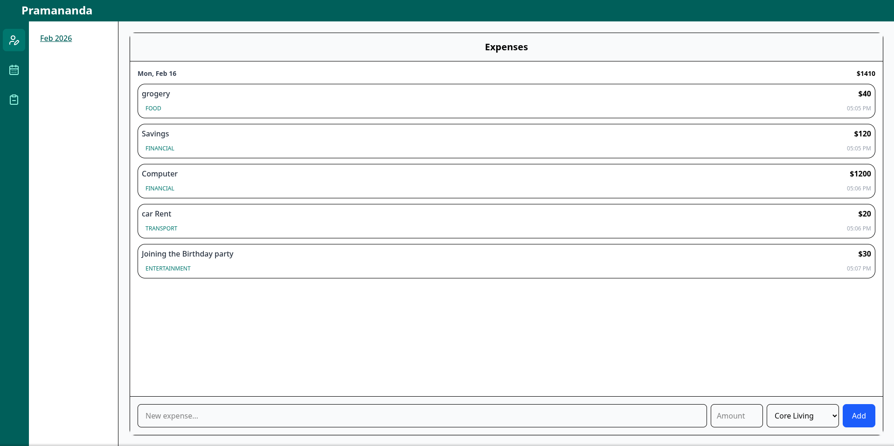
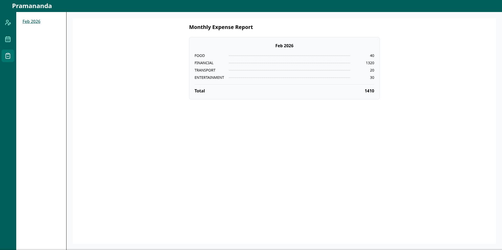

# Expense Management

> A full‑stack web application to track, manage, and analyze personal expenses with ease — built with **Next.js**, **TypeScript**, **Express**, and **MySQL**.

---

## 📌 Table of Contents

- [About](#about)
- [Features](#features)
- [Demo](#demo)
- [Tech Stack](#tech-stack)
- [Getting Started](#getting-started)
- [Usage](#usage)


---

## About

**Expense Management** is a full‑stack application designed to help users **log their expenses**, **visualize spending patterns**, and **stay on top of their personal finances**. Users can add, view, update, and delete expenses, and filter them based on time or category.

This project is ideal for **personal budgeting**, **financial tracking**, or as a base for more advanced finance tools.

---

## Features

- Add, edit, and delete expense entries  
- Categorize and filter expenses by date or category  
- View summarized expense insights  
- Modular full‑stack architecture  
- Docker support for easy local setup

---

## Demo
 


---

## Tech Stack

| Layer | Technology |
|--------|------------|
| Frontend | Next.js, React, TypeScript |
| Backend | Node.js, Express |
| Database | MySQL |
| Dev Tools | Docker, ESLint, Prettier |

---

## Getting Started


### Installation

1. **Clone this repo**

```bash
git clone https://github.com/pramanandasarkar02/expense-management.git
cd expense-management
```

2. **Start the app with Docker**

```bash
docker compose up --build
```

---

## Usage

* Create Account With UserName
* Add new expenses with descriptions, categories, and amounts
* Use filters to view monthly/weekly/yearly data
* Explore expense summaries or charts
